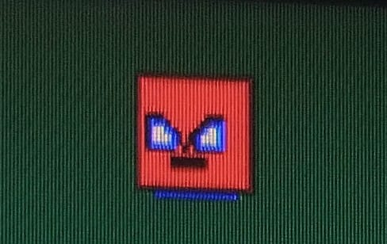
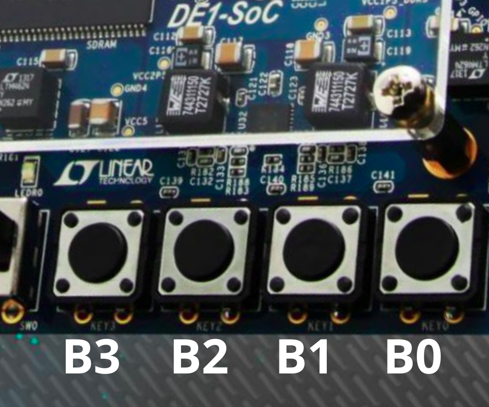

# :space_invader: :european_castle: :video_game: CASTLE INVADERS :video_game: :european_castle: :space_invader:

Jogo desenvolvido em linguagem C para atender aos requisitos do terceiro problema da disciplina TEC499 - Sistemas Digitais, do curso de Engenharia de Computação da Universidade Estadual de Feira de Santana (UEFS). O projeto utilizou funções da biblioteca criada pela equipe no [segundo problema da disciplina](https://github.com/GabrielSantosCruz/gpu-lib) com a GPU desenvolvida no seguinte trabalho de conclusão de curso: [TCC - Gabriel Sá](https://drive.google.com/file/d/1MlIlpB9TSnoPGEMkocr36EH9-CFz8psO/view).

## Equipe
- [Camila de Araújo Bastos](https://github.com/Caamilab)
- [Fernanda Marinho Silva](https://github.com/Fernanda-Marinho/)

## Executando o jogo 
### Clone do repositório
``` bash
git clone https://github.com/Caamilab Castle-Invaders 
``` 

### Execução do jogo
``` bash
cd Castle-Invaders/scripts/
make 
make run   
```

## Como jogar 
Para jogar CASTLE INVADERS, é necessário ter acesso à plataforma de desenvolvimento DE1-SoC disponível no Laboratório de Eletrônica Digital e Sistemas (LEDS) da UEFS e um mouse. 
<p align="center">
 
</p>
O jogo é composto por dois jogadores: o BLUESPRITE e o REDSPRITE. 

### BLUESPRITE

O jogador fica na parte de baixo do castelo.\
Para movimentação será necessário utilizar o acelerômetro presente na DE1-SoC.\
O objetivo é mover o sprite (direita - esquerda) até que ele atinja um invasor.  
<p align="center">
 
</p>

### REDSPRITE

O jogador fica na parte de cima do castelo.\
Para movimentação será necessário utilizar o mouse.\
O objetivo é mover o sprite (direita - esquerda) e clicar com o botão esquerdo para soltar um tiro e atingir o invasor. \
Não é permitido mais de um tiro por vez.  
<p align="center">
 
</p>

### INVADERS

Nenhum jogador pode ser invasor. \
Tem como objetivo atacar o castelo. \
Os jogadores precisam destruí-los.  
<p align="center">  
 
</p>


### INÍCIO, PAUSA E FIM

Para iniciar, pausar, retomar e encerrar o jogo, é necessário usar os botões dispostos na placa. \
Cada botão tem uma funcionalidade diferente.
<p align="center">  
 
</p>

| Botão  |   Ação            |                           Descrição                                    |
| -----  | --------          |--------------------------------------------------------------------  |
| B0     | Iniciar/Retomar           | É obrigatório o uso deste botão para iniciar o jogo. Caso esteja pausado, ele retoma.    |
| B1     | Pausar | Pausa o jogo em determinado ponto.     |
| B2     | Reiniciar| Reinicia o jogo do independente do momento que for acionado.           |
| B3     | Encerrar| Mata o processo e fecha o jogo.                                        |

### Tela do jogo 

Essa é a tela inicial do jogo, com os jogadores e o castelo. Neste momento é necessário apertar B0 para o jogo inciar. 
<p align="center">  
 
</p>

Neste momento o jogo já iniciou. Os invasores estão subindo e os jogadores devem usar mouse e acelerômetro para atingir os invasores e derrotá-los. 
<p align="center">  
 
</p>