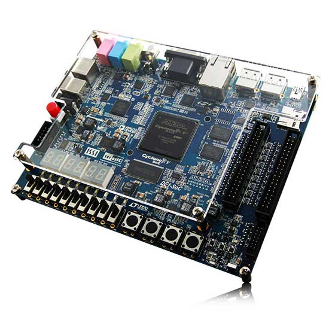
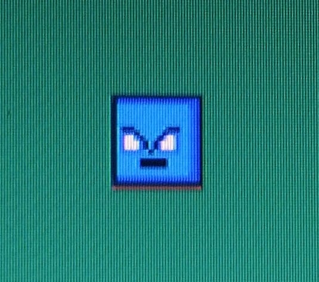

# :space_invader: :european_castle: :video_game: CASTLE INVADERS :video_game: :european_castle: :space_invader:

## Equipe:
- [Camila de Araújo Bastos](https://github.com/Caamilab)
- [Fernanda Marinho Silva](https://github.com/Fernanda-Marinho/)

## Executando o jogo 
### Clone do repositório
``` bash
git clone https://github.com/Caamilab Castle-Invaders 
``` 

### Execução do jogo
``` bash
cd Castle-Invaders/scripts/
make 
make run   
```

## Como jogar 
Para jogar CASTLE INVADERS, é necessário ter acesso à plataforma de desenvolvimento DE1-SoC e um mouse. 
<p align="center">
 
</p>
O jogo é composto por dois jogadores: o <span style="color:blue"> BLUESPRITE </span> e o <span style="color:red">
REDSPRITE 
</span>. 

### BLUESPRITE

O jogador fica na parte de baixo do castelo.\
Para movimentação será necessário utilizar o acelerômetro presente na DE1-SoC.\
O objetivo é mover o sprite (direita - esquerda) até que ele atinja um invasor.  
<p align="center">
 
</p>